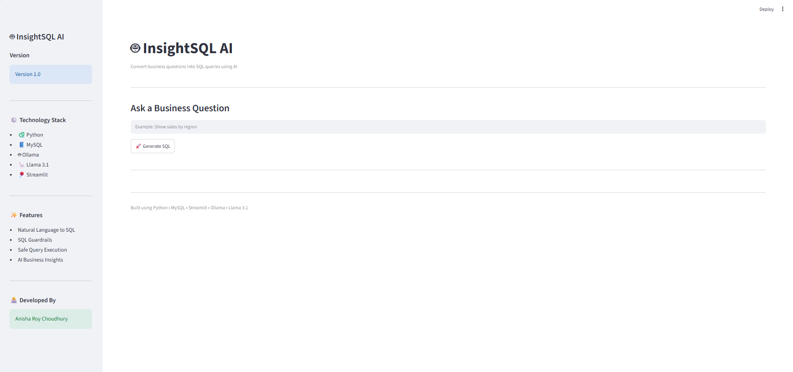
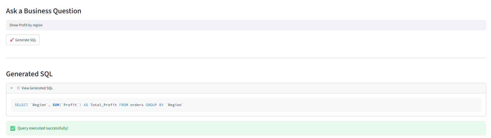
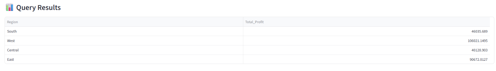
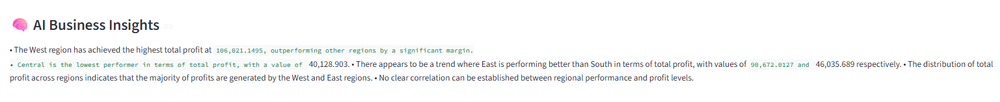
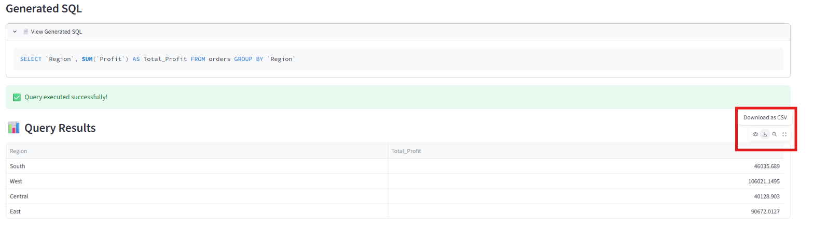

# 🤖 InsightSQL AI Assistant

An AI-powered SQL Analytics Assistant that converts natural language business questions into executable MySQL queries using a locally hosted Large Language Model (Llama 3.1 via Ollama). The application securely executes queries, validates SQL using built-in guardrails, and generates AI-powered business insights from the query results.

---

## 🚀 Features

- Convert natural language into MySQL queries
- Execute SQL securely on a MySQL database
- SQL Guardrails to prevent unsafe queries
- AI-generated business insights
- Automatic SQL cleaning
- AI retry mechanism for failed SQL
- Interactive Streamlit dashboard
- Export query results
- Query logging

---

## 🛠 Technology Stack

- Python
- MySQL
- Streamlit
- Ollama
- Llama 3.1
- Pandas

---

## 📂 Project Structure

```
InsightSQL-AI/

│── streamlit_app.py
│── app.py
│── llm.py
│── prompts.py
│── database.py
│── sql_executor.py
│── validators.py
│── sql_cleaner.py
│── retry_engine.py
│── logger.py

│── requirements.txt
│── README.md
│── .gitignore
│── .env

│── query_logs.txt

└── screenshots/
```

---

## ⚙️ System Architecture

```
User Question
       │
       ▼
Prompt Engineering
       │
       ▼
Llama 3.1 (Ollama)
       │
       ▼
Generated SQL
       │
       ▼
SQL Cleaner
       │
       ▼
SQL Guardrails
       │
       ▼
MySQL Execution
       │
       ▼
Query Results
       │
       ▼
AI Business Insights
       │
       ▼
Streamlit Dashboard
```

---

## 🔒 SQL Guardrails

The application blocks potentially harmful SQL statements, including:

- DROP
- DELETE
- UPDATE
- INSERT
- ALTER
- CREATE
- TRUNCATE

Only SELECT queries are allowed.

---

## 📊 Example Business Questions

- Show total sales by region
- Show yearly sales trend
- Show monthly sales trend
- Show total profit by region
- Show top 10 customers by revenue
- Show top 5 products by profit
- Show average discount by category
- Which state generated the highest profit?
- Show total sales by city
- Show quantity by ship mode

---

## 💡 AI Business Insights

After query execution, the application automatically generates business insights such as:

- Highest and lowest performing categories
- Regional performance comparison
- Revenue trends
- Profit analysis
- Business observations based only on returned data

---

## 📸 Screenshot

### Home Page



---

### Generated SQL



---

### Query Results



---

### AI Business Insights



---

### Export Feature



---

## ▶️ Installation

Clone the repository

```bash
git clone https://github.com/anisha-rc/InsightSQL-AI-Assistant.git
```

Navigate to the project

```bash
cd InsightSQL-AI-Assistant
```

Install dependencies

```bash
pip install -r requirements.txt
```

Start Ollama

```bash
ollama run llama3.1
```

Run the application

```bash
streamlit run streamlit_app.py
```

---

## 🎯 Future Improvements

- Support multiple SQL databases
- Interactive charts
- Dashboard generation
- Voice-to-SQL
- Role-based authentication
- Cloud deployment

---

## 👩‍💻 Author

**Anisha Roy Choudhury**

Built using Python, MySQL, Streamlit, Ollama and Llama 3.1.